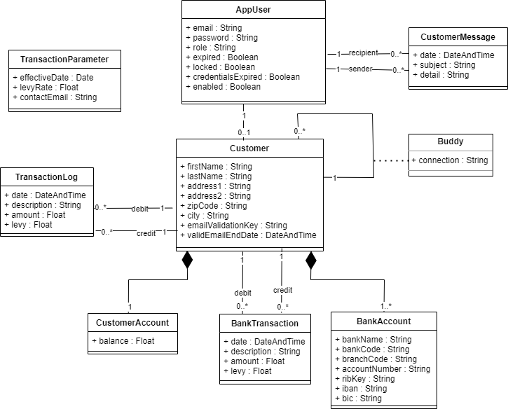
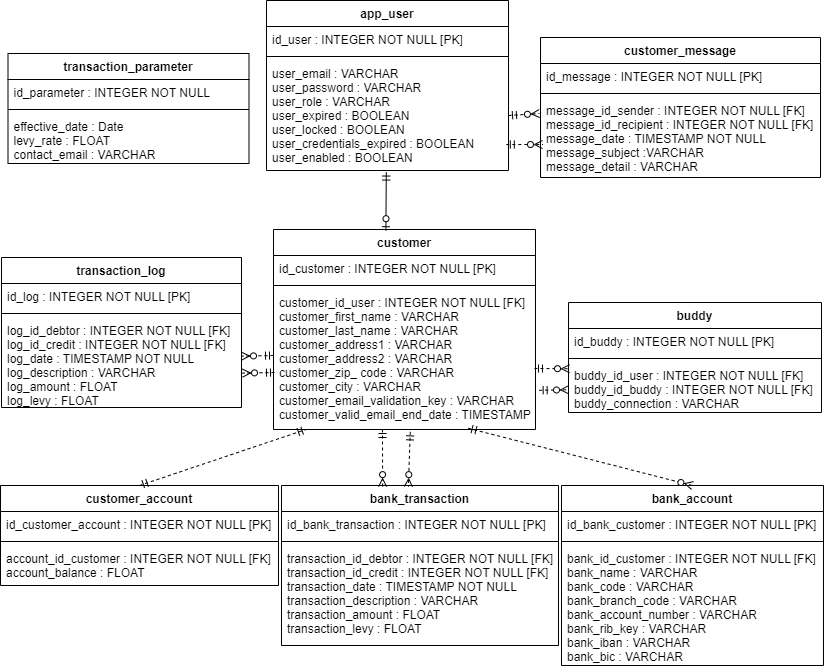

# PayMyBuddy

PayMyBuddy is an application for transferring money between buddies.

## Getting Started

These instructions allow you to run a copy of the project locally on your workstation for development and testing. Refer to the "Deployment" section for the steps to follow to deploy the project in production.

### Prerequisites

To run the PayMyBuddy project locally, you must first install :

```
1. Install Java :
https://www.oracle.com/java/technologies/javase/jdk19-archive-downloads.html
The JAVA_HOME variable must be set.

2. Install MysSql :
https://downloads.mysql.com/archives/get/p/25/file/mysql-installer-community-8.0.27.1.msi
```

### Installation

Here are the steps to follow to have a working development and test environment :


```
1. Clone the Git repository to your local machine.
   * git clone https://github.com/MichelCat/PayMyBuddy.git

2. Place yourself in the directory.
   * cd PayMyBuddy

3. Configure MySql database connection information in file "src/main/resources/application.properties".
   * spring.datasource.url=jdbc:mysql://localhost:3306/PayMyBuddyProd
   * spring.datasource.username -> Username for the MySQL database
   * spring.datasource.password -> Password for the MySQL database

4. Run Maven commands to generate PayMyBuddy packages.
   * mvnw clean install
   * mvnw package

4. Run Maven commands for Surefire and Jacoco reports in directory "target/site".
   * mvnw verify
   * mvnw surefire-report:report
   * mvnw site
   
5. Configure MySql
Production environment
   * Database configuration script : "src\main\resources\schema.sql"
   * Script to add data : "src\main\resources\data.sql"
Test Environment
   * Database configuration script : "src\test\ressources\schema.sql"
```

## Deployment

Here are the steps to deploy to production :

```
1. Run the Maven command to run the application.
   * java -jar target\paymybuddy-0.0.1-SNAPSHOT.jar

2. Once the application is running, it can be accessed by default at http://localhost:8080/

```

## Use

**User**

```
1. Register
    * Click on the Register button. Register with your email address.
    * Validate the activation email received in the mailbox.
    * Connect with his email.

2. Once connected.
    * Fill in your profile
    * Fill in your friend list by adding connections

3. Money transfer
    * Select a connection and enter the amount. Then click the pay button.

4.Contact.
    * The user can send a message to the contact.   
```

**Administrator**

```
Two accounts created.

|    E-mail       | Password |   Definition   |
|-----------------|---:------|----------------|
| admin@gmail.com |   test   | Administrateur |
| admin@gmail.com |   test   | Email contact  |

1. Account Management.
```

**Balance**

```
Two ways to change user balance.
1. By money transfer.
2. By script.
	update customer_account
	inner join customer on id_customer = id_customer_account
	inner join app_user on id_user = customer_id_user
	set account_balance = 200.0
	WHERE user_email='guto@gmail.com';
```

## Technologies

* [Java JDK 19.0.1](https://www.oracle.com/java/technologies/javase/jdk19-archive-downloads.html)
* [Maven 3.8.6](https://maven.apache.org/)
* [MysSql 8.0.27](https://dev.mysql.com/downloads/installer/)
* [SpringBoot 3.0.5](https://spring.io/projects/spring-boot)
* Spring Security 6
* Spring Data JPA
* Thymeleaf
* [Bootstrap  v5.3.0-alpha3](https://getbootstrap.com/)
* [Bootstrap-icons](https://cdn.jsdelivr.net/npm/bootstrap-icons@latest/)
* [jQuery v3.6.4](https://jquery.com/download/)
* [Font Awesome Free 6.4.0](https://fontawesome.com/download)
* HTML5/CSS3
* Jacoco
* SureFire
* SonarLint
* Slf4j
* Javadoc
* JUnit 5

## Documentations

### Class diagram UML


### MPD


## Auteurs

* **OpenClassrooms student**
